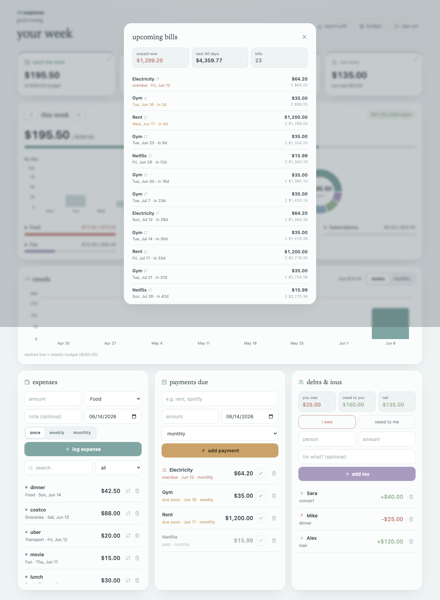

# GOexpense

A clean personal expense + budget tracker that runs entirely on your own
computer. Log your spending, set weekly budgets, track bills and IOUs, see
charts, and export a week-by-week PDF report.

**Your data stays in your browser — nothing is uploaded anywhere, no account, no sign-up.**

Built with React + Vite. Charts by Recharts.


---

## What it does

- **Weekly budget** with a by-day bar chart, a by-category donut, and pace tracking
- **Expenses** — log amount, category, note, and date; search and filter them
- **Recurring expenses** — mark something weekly/monthly and it auto-logs itself
- **Payments due** — rent/subscriptions/one-offs, with overdue + due-soon flags; mark paid and recurring bills roll to the next cycle
- **Debts & IOUs** — who you owe and who owes you, with a running net
- **Trends** — spending over the last 8 weeks or 6 months vs. your budget
- **Tap-through analytics** — press any summary card at the top to open a detail view: spending breakdown by category, budget usage, debts, or upcoming bills
- **Upcoming bills** — recurring bills projected 90 days forward, in date order, with overdue flags and a running total (open it from the "unpaid bills" card)
- **PDF export** — a tidy week-by-week report with charts (see `docs/report.png`)



---

# How to run it (complete beginner guide)

You do **not** need to know how to code, and you don't need to sign up for
anything. Follow these steps exactly, in order. Total time: about 5 minutes.

> Anything written `like this` is something you type or click. Don't type the
> surrounding quotes.

### 1. Install Node.js (this runs the app)
1. Go to **https://nodejs.org**
2. Click the big button that says **LTS** (the recommended version).
3. Open the file it downloads and click **Next / Continue / Install** until it finishes.

### 2. Open a terminal
- **Mac:** press `Cmd + Space`, type `Terminal`, press Enter.
- **Windows:** press the Start button, type `PowerShell`, press Enter.

### 3. Download this app
**Easiest (no Git needed):**
1. On this project's GitHub page, click the green **`< > Code`** button.
2. Click **Download ZIP**.
3. Find the `.zip` in your Downloads folder and **double-click to unzip it**.

**Or, if you have Git:**
```bash
git clone <THIS-REPO-URL>
```

### 4. Go into the app's folder in the terminal
Type `cd ` (with a space after it), then **drag the unzipped folder onto the
terminal window** (this pastes the path for you), then press Enter. It looks like:
```bash
cd /Users/you/Downloads/goexpense-main
```

### 5. Install the app's parts
Type this and press Enter (it takes a minute, lots of text scrolls by — that's normal):
```bash
npm install
```

### 6. Start it!
Type this and press Enter:
```bash
npm run dev
```
It will print a line like **`Local: http://localhost:5173`**.

### 7. Open it in your browser
Go to **http://localhost:5173**

🎉 That's it — no login, it just opens. Click **"load sample data"** to see it
filled in, or start logging your own expenses. Everything is saved automatically
in your browser.

> To stop the app: go back to the terminal and press `Ctrl + C`.
> To start it again later: open the terminal, `cd` into the folder (step 4), and
> run `npm run dev` again.

---

## Where is my data?

Everything is stored in your web browser's local storage on your own computer
(under keys starting with `goexpense:`). It is **never** sent over the internet.
It stays as long as you don't clear your browser's site data, and it's tied to
the browser you used.

> Tip: because the data lives in the browser, using a different browser or a
> private/incognito window starts you fresh.

## Build a shareable version (optional)

```bash
npm run build     # creates an optimized site in the dist/ folder
npm run preview   # preview that build locally
```

The `dist/` folder is a plain static site — you can host it on Vercel, Netlify,
GitHub Pages, or any static host, and it still keeps each visitor's data in their
own browser.

## Tech

React 19 · Vite · Recharts · lucide-react

## License

MIT — do whatever you like with it.
