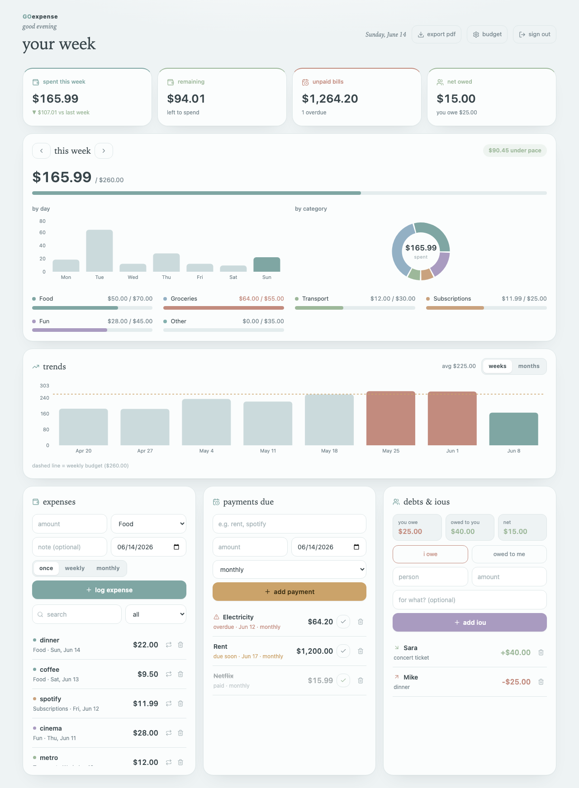

# GOexpense

A clean, cloud-backed personal expense + budget tracker. Log your spending, set
weekly budgets, track bills and IOUs, see charts, and export a week-by-week PDF
report. Every account's data is private and saved to the cloud, so it syncs on
any device you log in from.

Built with React + Vite + Supabase. Charts by Recharts.



---

## What it does

- **Weekly budget** with a by-day bar chart, a by-category donut, and pace tracking
- **Expenses** — log amount, category, note, and date; search and filter them
- **Recurring expenses** — mark something weekly/monthly and it auto-logs itself
- **Payments due** — rent/subscriptions/one-offs, with overdue + due-soon flags; mark paid and recurring bills roll to the next cycle
- **Debts & IOUs** — who you owe and who owes you, with a running net
- **Trends** — spending over the last 8 weeks or 6 months vs. your budget
- **PDF export** — a tidy week-by-week report with charts (see `docs/report.png`)
- **Accounts** — email + password login; your data is private to you

---

# How to run it (complete beginner guide)

You do **not** need to know how to code. Follow these steps exactly, in order.
Total time: about 15 minutes. You'll do two things: (A) set up a free database,
and (B) run the app on your computer.

> Anything written `like this` is something you type or click. Don't type the
> surrounding quotes.

---

## Part A — Set up your free database (Supabase)

GOexpense stores your data in a free service called **Supabase**. You need your
own, it's free, no credit card.

### A1. Make a Supabase account
1. Go to **https://supabase.com**
2. Click **Start your project** (top right) and sign up (Google or email — your choice).

### A2. Create a project
1. After signing in you'll see a dashboard. Click **New project**.
2. **Name:** type `goexpense` (or anything).
3. **Database Password:** click **Generate a password**, then click the **copy** icon and paste it somewhere safe (you won't need it for this app, but don't lose it).
4. **Region:** pick the one closest to you.
5. Click **Create new project**.
6. Wait ~2 minutes while it says "Setting up project". Get a coffee.

### A3. Create the data tables (copy-paste, no thinking required)
1. On the left sidebar, click the **SQL Editor** icon (looks like `</>` or "SQL").
2. Click **+ New query**.
3. Open the file **`supabase/migrations/0001_init.sql`** from this download, select **everything** in it (Ctrl+A / Cmd+A), and copy it (Ctrl+C / Cmd+C).
4. Paste it into the big empty box in the SQL Editor.
5. Click the green **Run** button (bottom right). You should see **"Success. No rows returned."** That's correct — it just built your tables. ✅

### A4. Turn off email confirmation (so login is instant)
1. Left sidebar → **Authentication**.
2. Click **Sign In / Providers** (or **Providers**).
3. Find **Email** and click it.
4. Make sure the **Email** provider is **turned ON**.
5. Find **Confirm email** and turn it **OFF**.
6. Click **Save**.

### A5. Copy your two connection values (you'll paste them in Part B)
1. Left sidebar → **Project Settings** (the gear icon at the bottom).
2. Click **API**.
3. You'll see two things you need:
   - **Project URL** — looks like `https://abcdefgh.supabase.co`
   - **Project API Keys → `anon` `public`** — a very long string starting with `eyJ...`
4. Keep this tab open; you'll copy these in step B6.

> ⚠️ There's also a **`service_role`** secret key on that page. **Never** use or
> share that one. You only ever need the **`anon` `public`** key.

---

## Part B — Run the app on your computer

### B1. Install Node.js (this runs the app)
1. Go to **https://nodejs.org**
2. Click the big button that says **LTS** (the recommended version).
3. Open the file it downloads and click **Next / Continue / Install** until it finishes.
4. To check it worked: open your terminal (see B2) and type `node -v` then Enter. If it prints a number like `v22.1.0`, you're good.

### B2. Open a terminal
- **Mac:** press `Cmd + Space`, type `Terminal`, press Enter.
- **Windows:** press the Start button, type `PowerShell`, press Enter.

### B3. Download this app
**Option 1 (easiest — no Git needed):**
1. On this project's GitHub page, click the green **`< > Code`** button.
2. Click **Download ZIP**.
3. Find the downloaded `.zip` in your Downloads folder and **double-click to unzip it**.

**Option 2 (if you have Git):**
```bash
git clone <THIS-REPO-URL>
```

### B4. Go into the app's folder in the terminal
Type `cd ` (with a space after it), then **drag the unzipped folder from your file
browser onto the terminal window** (this pastes the path for you), then press Enter.

It should look something like:
```bash
cd /Users/you/Downloads/goexpense-main
```

### B5. Install the app's parts
Type this and press Enter (it takes a minute, lots of text scrolls by — that's normal):
```bash
npm install
```

### B6. Add your database keys
1. In the app folder, find the file named **`.env.example`**.
2. Make a copy of it and rename the copy to exactly **`.env`** (yes, just a dot and the word env, no `.example`).
   - Mac/Windows terminal shortcut: `cp .env.example .env`
3. Open `.env` in any text editor (TextEdit, Notepad, VS Code — anything).
4. Replace the placeholder values with the two things you copied in step **A5**:
   ```
   VITE_SUPABASE_URL=https://abcdefgh.supabase.co
   VITE_SUPABASE_ANON_KEY=eyJ...your-long-anon-key...
   ```
5. Save the file.

### B7. Start it!
Type this and press Enter:
```bash
npm run dev
```
It will print a line like **`Local: http://localhost:5173`**.

### B8. Open it in your browser
Open your web browser and go to **http://localhost:5173**

🎉 You'll see a **GOexpense** login screen. Click **"new here? create an account"**,
enter any email and a password (6+ characters), and you're in. Click **"load sample
data"** to see it filled in, or start logging your own expenses.

> To stop the app: go back to the terminal and press `Ctrl + C`.
> To start it again later: open the terminal, `cd` into the folder (B4), and run
> `npm run dev` again.

---

## Build a production version (optional, for hosting)

```bash
npm run build     # creates an optimized site in the dist/ folder
npm run preview   # preview that build locally
```

The `dist/` folder is a plain static site — you can drop it on Vercel, Netlify,
GitHub Pages, or any static host.

---

## Is my data safe?

Yes. Each account can only ever see its own data — this is enforced by the
database itself using Supabase **Row Level Security** (see the policies in
`supabase/migrations/0001_init.sql`). The app only ever uses the public `anon`
key, which is designed to be safe in frontend code.

## Tech

React 19 · Vite · Supabase (Postgres + Auth + RLS) · Recharts · lucide-react

## License

MIT — do whatever you like with it.
